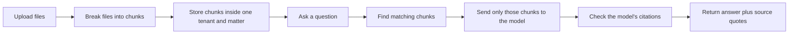
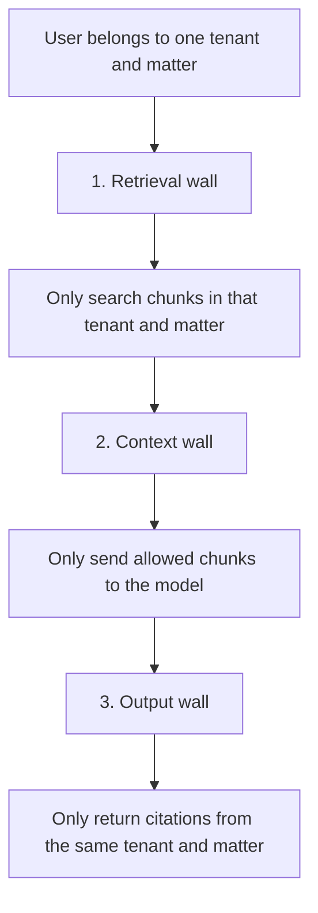
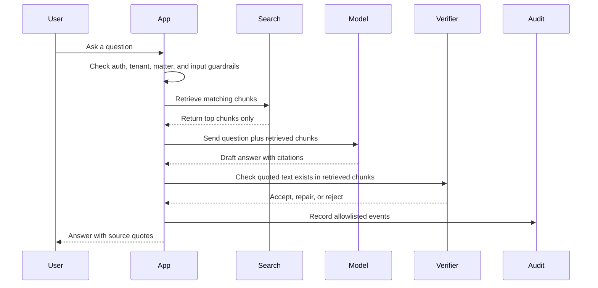
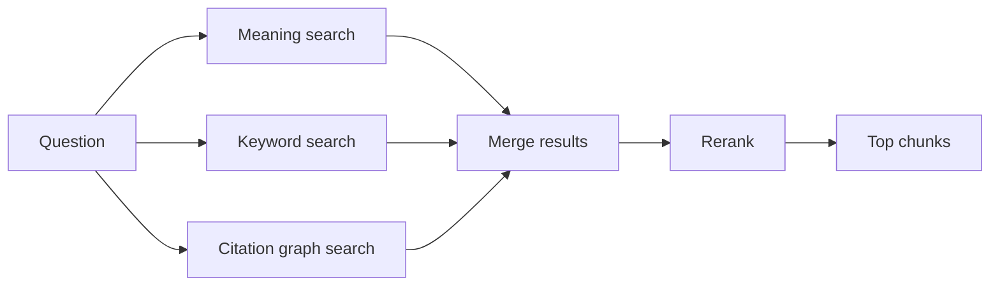

# cite-or-die

Ask questions about your own documents and get answers with source quotes.

`cite-or-die` is for people who need answers from documents, but cannot accept
unsourced model guesses. Upload files, ask a question, and the app only lets the
model answer from document chunks it found. If the answer cannot be tied back to
the retrieved text, the app rejects or repairs it.

## What You Use It For

- Ask long PDFs, contracts, filings, notes, and reports direct questions.
- Check where each answer came from before trusting it.
- Keep one client, team, case, or project away from another.
- Run a free fake model for demos and tests.
- Switch to OpenAI, Anthropic, Ollama, DeepSeek, Kimi, Hugging Face, or Qwen when
  you want real model answers.
- Self-host the stack with Docker when the documents should stay on your machine
  or server.

## What Makes It Different

This is not unique because nobody has ever built legal RAG. They have. Some
commercial tools already claim self-hosting, legal citations, ethical walls, and
audit logs.

The useful difference here is that this repo puts the whole pattern in one small,
inspectable, self-hosted codebase:

- retrieval is tenant and matter scoped;
- only retrieved chunks go to the model;
- citations are checked against exact retrieved text;
- the answer is repaired or rejected when citations do not verify;
- audit events are written with a hash chain;
- adversarial PDF tests and mutation tests are part of the release gates;
- the model layer is swappable instead of tied to one vendor.

In short: this is a reference implementation for people who want to see the
controls in code, run them locally, and change the model provider.

## Why This Is Hard

Normal chat-with-docs apps usually focus on convenience: upload files, search
them, and ask a model to answer. Legal and confidential work needs more than
that.

The hard parts are:

- retrieval can accidentally pull the wrong matter;
- a model can cite text that does not actually support the answer;
- post-filtering after retrieval can be too late because sensitive data was
  already fetched;
- audit logs must prove what happened without storing raw secrets or document
  text;
- local models, hosted models, Docker, and eval tests all need different setup
  paths.

Research and competitor checks showed the pieces exist, but there is no public
legal-RAG benchmark that validates conflict screening, matter access,
confidentiality, auditability, adversarial behavior, and citation grounding as
one end-to-end system.

Useful source pages:

- LegalBench-RAG: https://arxiv.org/html/2408.10343v1
- Stanford legal AI hallucination benchmark: https://hai.stanford.edu/news/ai-trial-legal-models-hallucinate-1-out-6-or-more-benchmarking-queries
- Isaacus Legal RAG Bench: https://huggingface.co/blog/isaacus/legal-rag-bench
- Cerbos on RAG access control: https://www.cerbos.dev/features-benefits-and-use-cases/access-control-for-rag
- Qdrant multitenancy: https://qdrant.tech/documentation/manage-data/multitenancy/
- Weaviate multi-tenancy: https://docs.weaviate.io/weaviate/manage-collections/multi-tenancy

## The Simple Idea



The model does not get your whole document library. A hosted model only receives
the small chunks selected for the current question.

## Use Case Example

Imagine a law firm with two matters:

- `Client A / Acquisition`
- `Client B / Litigation`

A user working in `Client A / Acquisition` asks:

```text
What does the contract say about board consent?
```

The app should only search `Client A / Acquisition` documents. It should not
retrieve, show, cite, or leak anything from `Client B / Litigation`.

That is what this project means by ethical walls.

## Ethical Walls, In Plain English

An ethical wall is a hard boundary around sensitive work. It stops the wrong
person, case, or client from seeing the wrong document.

This app checks the wall three times:



What those words mean:

- Tenant: a customer, firm, team, or workspace.
- Matter: a case, project, deal, or work area inside a tenant.
- Retrieval wall: search only inside the current tenant and matter.
- Context wall: send only those allowed chunks to the model.
- Output wall: reject citations that point outside the current tenant and matter.

The app also writes audit events with allowlisted fields. Raw prompts, raw
documents, and raw model output are not logged by default.

## What Is Secure Today

Built today:

- Bearer-token authentication for API requests.
- JWT claims for tenant, matter, subject, and role.
- Casbin authorization for upload, chat, read, and admin actions.
- Tenant and matter checks before upload, chat, document list, and source file
  access.
- Retrieval scoped by `tenant::matter`.
- Output citation scope checks before returning answers.
- Development token helper disabled when `CITE_OR_DIE_APP_ENV=prod`.
- Docker secrets for auth and provider keys.
- SOPS+age encrypted environment template.
- Hash-chain audit log.
- PII and prompt-injection guardrails.
- Hosted model providers are blocked in production until
  `CITE_OR_DIE_ALLOW_HOSTED_LLM=true` is set.

Not built yet:

- No username/password login screen.
- No user invitation flow.
- No SSO, SAML, or OIDC integration.
- No admin UI for managing users, roles, tenants, or matters.
- No external security audit.
- No claim that Docker defaults are production-hardened for the open internet.

Production should put a real identity layer in front of the app and pass bearer
tokens with the correct tenant, matter, and role claims.

## Sensitive Client Details And Hosted Models

Be blunt about this: if a selected chunk contains sensitive client details, and
you use a hosted model, those details can be sent to that hosted provider.

The app reduces exposure by:

- sending only the retrieved chunks, not the full document library;
- keeping chunks inside the current tenant and matter;
- redacting detected email addresses, US SSNs, and phone numbers before chunking;
- blocking obvious prompt-injection text in questions and retrieved chunks;
- avoiding raw prompts and raw document text in audit logs.

The app does not remove every possible confidential fact. Names, deal terms,
contract clauses, strategy notes, medical facts, financial figures, and other
client-specific details can still appear in a retrieved chunk.

Use this rule:

- `fake`: no real model call; safest for tests.
- `ollama`: local model call; best when client details must stay on your machine.
- `openai`, `anthropic`, `openai-compatible`: hosted model call; the question and
  selected chunks leave your machine or server.

In production, hosted providers are blocked unless you explicitly set:

```bash
CITE_OR_DIE_ALLOW_HOSTED_LLM=true
```

That flag is an acknowledgement, not a privacy guarantee.

## How A Chat Works



## Run It Locally

```bash
./install.sh
uv run cite-or-die serve --host 127.0.0.1 --port 8765
```

Open `http://127.0.0.1:8765`.

The first run uses:

- `CITE_OR_DIE_LLM_PROVIDER=fake`
- `CITE_OR_DIE_VECTOR_BACKEND=memory`
- hash-based local embeddings

That means no hosted LLM key, no Qdrant, and no Docker are needed for the first
demo.

The browser UI can mint a development token automatically only outside
production. In production, paste a real bearer token into the `Access token`
field or run the app behind your own identity layer.

## One-Line Setups

Local laptop, no model key:

```bash
CITE_OR_DIE_LLM_PROVIDER=fake CITE_OR_DIE_VECTOR_BACKEND=memory CITE_OR_DIE_EMBEDDING_PROVIDER=hash uv run cite-or-die serve --host 127.0.0.1 --port 8765
```

Local laptop with a real OpenAI model:

```bash
CITE_OR_DIE_LLM_PROVIDER=openai CITE_OR_DIE_LLM_MODEL=<model> CITE_OR_DIE_OPENAI_API_KEY=<key> CITE_OR_DIE_VECTOR_BACKEND=memory CITE_OR_DIE_EMBEDDING_PROVIDER=hash uv run cite-or-die serve --host 127.0.0.1 --port 8765
```

Local laptop with Ollama models such as Qwen or DeepSeek:

```bash
ollama pull qwen3:8b && CITE_OR_DIE_LLM_PROVIDER=ollama CITE_OR_DIE_LLM_MODEL=qwen3:8b CITE_OR_DIE_OLLAMA_BASE_URL=http://localhost:11434 uv run cite-or-die serve --host 127.0.0.1 --port 8765
```

Local laptop with Hugging Face embeddings and reranking:

```bash
uv sync --extra local-models && CITE_OR_DIE_EMBEDDING_PROVIDER=bge-m3 CITE_OR_DIE_RERANKER_PROVIDER=bge-reranker-v2-m3 uv run cite-or-die serve --host 127.0.0.1 --port 8765
```

Hosted OpenAI-compatible provider, for DeepSeek, Kimi, Hugging Face router, or
Qwen DashScope:

```bash
CITE_OR_DIE_LLM_PROVIDER=openai-compatible CITE_OR_DIE_OPENAI_COMPATIBLE_BASE_URL=<base-url> CITE_OR_DIE_OPENAI_COMPATIBLE_API_KEY=<key> CITE_OR_DIE_LLM_MODEL=<model> uv run cite-or-die serve --host 127.0.0.1 --port 8765
```

Server bind with a real OpenAI model:

```bash
CITE_OR_DIE_APP_ENV=prod CITE_OR_DIE_ALLOW_HOSTED_LLM=true CITE_OR_DIE_AUTH_SECRET=<32-plus-character-secret> CITE_OR_DIE_LLM_PROVIDER=openai CITE_OR_DIE_LLM_MODEL=<model> CITE_OR_DIE_OPENAI_API_KEY=<key> uv run cite-or-die serve --host 0.0.0.0 --port 8765
```

Docker on a laptop or server:

```bash
./install.sh && docker compose up --build
```

## Which Model Mode Should I Use?

| Need | Use |
| --- | --- |
| Quick demo with no key | `CITE_OR_DIE_LLM_PROVIDER=fake` |
| Hosted OpenAI | `CITE_OR_DIE_LLM_PROVIDER=openai` |
| Hosted Anthropic | `CITE_OR_DIE_LLM_PROVIDER=anthropic` |
| Local Ollama model | `CITE_OR_DIE_LLM_PROVIDER=ollama` |
| DeepSeek, Kimi, Hugging Face router, Qwen DashScope | `CITE_OR_DIE_LLM_PROVIDER=openai-compatible` |

Provider base URLs verified from current public docs:

- DeepSeek: `https://api.deepseek.com`
- Kimi/Moonshot: `https://api.moonshot.ai/v1`
- Hugging Face Inference Providers: `https://router.huggingface.co/v1`
- Alibaba Qwen DashScope, Singapore: `https://dashscope-intl.aliyuncs.com/compatible-mode/v1`

## Laptop Or Server?

Use a laptop when you are testing, demoing, or working with a small private
document set.

Use a server when you need:

- other people to connect;
- persistent storage;
- Docker services such as Qdrant, Postgres, Redis, Caddy, Prometheus, Loki,
  Tempo, and Grafana;
- provider keys stored as Docker secrets.

The Docker stack starts the app and its production-style support services:

```bash
./install.sh
docker compose up --build
```

Then visit:

- App: `https://cite-or-die.localhost`
- Prometheus: `http://localhost:9090`
- Grafana: `http://localhost:3000`

## What Gets Sent To A Model?

If you use a hosted provider, the provider gets:

- your question;
- the selected document chunks;
- the model request metadata needed to answer.

The provider does not get:

- every document in the library;
- other tenants' documents;
- other matters' documents;
- audit logs.

For the most private setup, run Ollama locally and keep the app on your own
machine or server.

## What The App Does Not Do

- It does not train a model.
- It does not guarantee a hosted provider forgets the chunks you send it.
- It does not replace legal review.
- It does not magically solve conflicts without correct tenant and matter setup.
- It does not provide full enterprise identity management yet.

## Search, In Simple Terms

The app combines several ways to find useful chunks:



- Meaning search finds chunks with similar meaning.
- Keyword search finds chunks with matching words.
- Citation graph search follows nearby chunks and shared references.
- Reranking sorts the candidates before the model sees them.

## Speed, Cost, And Quality

Most chat latency comes from:

- how many chunks are searched;
- whether reranking is enabled;
- whether the model is local or hosted;
- how fast that model responds.

Fast local demo:

```bash
CITE_OR_DIE_RETRIEVAL_TOP_K=5 CITE_OR_DIE_RETRIEVAL_CANDIDATE_K=20 CITE_OR_DIE_RERANKER_PROVIDER=none CITE_OR_DIE_LLM_PROVIDER=fake uv run cite-or-die serve --host 127.0.0.1 --port 8765
```

Balanced default:

```bash
CITE_OR_DIE_RETRIEVAL_TOP_K=8 CITE_OR_DIE_RETRIEVAL_CANDIDATE_K=50 CITE_OR_DIE_RERANKER_PROVIDER=lexical CITE_OR_DIE_CITATION_GRAPH_ENABLED=true uv run cite-or-die serve --host 127.0.0.1 --port 8765
```

For faster and cheaper answers, lower `CITE_OR_DIE_RETRIEVAL_TOP_K` and
`CITE_OR_DIE_RETRIEVAL_CANDIDATE_K`. For better recall, raise them and accept
more latency.

Run a local load test against your own hardware and provider:

```bash
uv run locust -f tests/load/locustfile.py --host http://127.0.0.1:8765
```

## Try The CLI

```bash
uv run cite-or-die ingest examples/sample.txt
uv run cite-or-die chat "What does the sample say?"
```

The CLI does the same basic work as the web app: ingest a file, retrieve matching
chunks, ask the configured provider, and verify citations.

## Common Commands

| Task | Command |
| --- | --- |
| Install dev dependencies | `./install.sh` |
| Run local app | `make run` |
| Ingest the Tesla sample filing | `make seed-tesla` |
| Run local smoke script | `make smoke` |
| Run unit, integration, and eval tests | `make e2e-local` |
| Run retrieval quality gate | `make eval-t2ragbench-100` |
| Run adversarial guardrail tests | `make adversarial` |
| Run mutation gate | `make mutation` |
| Run citation graph eval | `make eval-graph` |
| Run load test | `make load` |
| Run release security checks | `make release-security` |
| Build PyPI artifacts | `make build-dist` |
| Build Docker image | `make docker-build` |

## Quality Gates

```bash
uv run ruff check .
uv run mypy src/cite_or_die app
uv run pytest
make eval-t2ragbench-100
make adversarial
make mutation
make eval-graph
make release-security
make release-check
make build-dist
```

Provider smoke checks:

```bash
PROVIDER=fake make provider-smoke
PROVIDER=openai CITE_OR_DIE_LLM_MODEL=<model> CITE_OR_DIE_OPENAI_API_KEY=<key> make provider-smoke
PROVIDER=anthropic CITE_OR_DIE_LLM_MODEL=<model> CITE_OR_DIE_ANTHROPIC_API_KEY=<key> make provider-smoke
PROVIDER=openai-compatible CITE_OR_DIE_LLM_MODEL=<model> CITE_OR_DIE_OPENAI_COMPATIBLE_BASE_URL=<base-url> CITE_OR_DIE_OPENAI_COMPATIBLE_API_KEY=<key> make provider-smoke
PROVIDER=ollama CITE_OR_DIE_LLM_MODEL=<model> CITE_OR_DIE_OLLAMA_BASE_URL=http://localhost:11434 make provider-smoke
```

## Plain Terms

| Term | Plain meaning |
| --- | --- |
| RAG | Retrieval-augmented generation. The app searches your documents before asking the model to answer. |
| Citation | A source quote attached to an answer. The app checks that the quote exists in the retrieved chunks. |
| Chunk | A small piece of a document. The app searches chunks instead of whole files. |
| Tenant | A customer, firm, team, or workspace. |
| Matter | A case, project, deal, or work area inside a tenant. |
| Ethical wall | A boundary that prevents one tenant or matter from seeing another tenant or matter. |
| Embedding | A numeric version of text used for meaning search. |
| BM25 | Keyword search that rewards matching important words. |
| RRF | Reciprocal rank fusion. A way to merge ranked search lists. |
| Reranker | A second sorting pass before chunks go to the model. |
| Citation graph | Links between nearby chunks and shared references. |
| PageRank | A graph scoring method used to surface connected chunks. |
| Guardrail | A check that can accept, repair, or reject risky input or output. |
| Audit log | A tamper-evident record of important events using allowlisted fields. |
| SBOM | Software bill of materials. A machine-readable dependency list. |
| FakeLLM | A deterministic local provider used for repeatable tests and demos. |

## Secrets

`secrets.enc.env` is the encrypted environment template. Decrypt it on machines
with the configured age identity:

```bash
SOPS_AGE_KEY_FILE=~/.config/sops/age/keys.txt sops --decrypt secrets.enc.env > secrets.dec.env
```

`secrets.dec.env` stays ignored. Docker secrets live in `secrets/*.txt`;
`./install.sh` creates local placeholder files for development.

## Production Notes

- Replace the development auth secret before deployment.
- Use Docker secrets or SOPS+age for provider keys.
- Start with FakeLLM in staging, then enable one hosted or local provider.
- Keep `CITE_OR_DIE_EMBEDDING_PROVIDER=hash` for lightweight smoke tests.
- Use `CITE_OR_DIE_EMBEDDING_PROVIDER=bge-m3` only after installing
  `uv sync --extra local-models`.
- Release publishing is manual and requires the `ship it` workflow confirmation
  plus PyPI and Docker Hub credentials.

## Distribution

`make release-check` verifies that the package version, runtime `__version__`,
and Docker Compose image tag are all `1.0.0`.

`make release-security` runs the dependency CVE audit and writes a CycloneDX SBOM
to `dist/security/`.

The release workflow is manual. It publishes only when the workflow input is
confirmed with `ship it` and the required PyPI and Docker Hub credentials are
configured.

See `docs/distribution.md` for the exact PyPI and Docker Hub publish setup.
