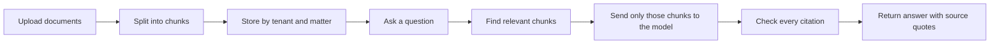
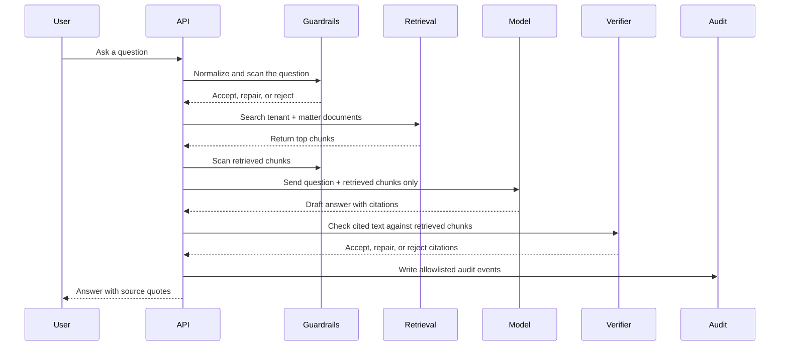
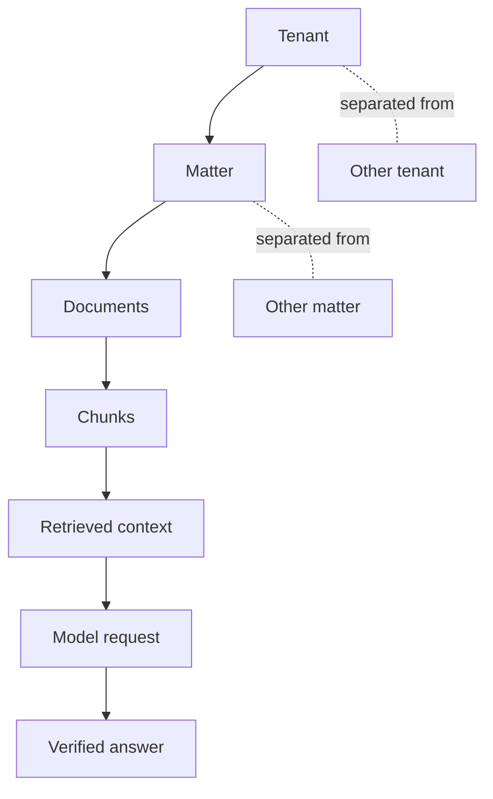
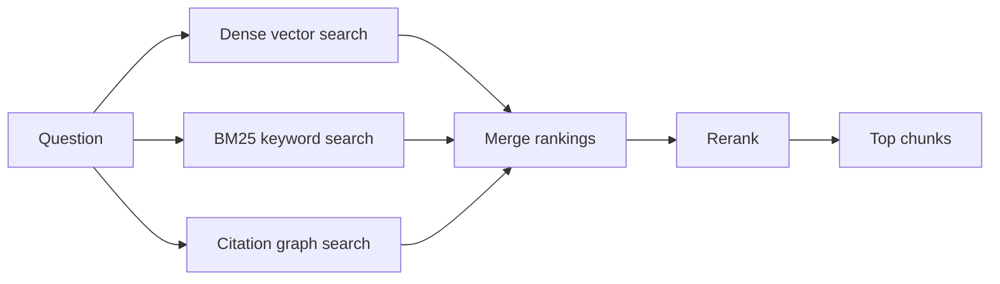

# cite-or-die

Ask questions about your own documents and get answers that point back to exact source text.

`cite-or-die` is a local-first RAG app. In plain terms: you upload documents, ask a
question, and the app only lets the model answer from the parts of those documents it
found. If an answer cannot be tied back to the retrieved text, the app rejects or repairs it.

## Why This Is Useful

- You can question long PDFs, contracts, reports, filings, notes, and Markdown files.
- You can see where each answer came from instead of trusting a model from memory.
- You can keep different customers, teams, or legal matters separated.
- You can run a fake local model for tests, or connect OpenAI, Anthropic, or Ollama.
- You get audit logs, metrics, adversarial tests, and release checks for production work.

## The Short Version



The key idea is simple: the model does not get your whole document library. It only gets the
small pieces that retrieval selected for the current question.

## Install And Run Locally

```bash
./install.sh
uv run cite-or-die serve --host 127.0.0.1 --port 8765
```

Open `http://127.0.0.1:8765`.

The default local setup uses:

- `CITE_OR_DIE_LLM_PROVIDER=fake`
- `CITE_OR_DIE_VECTOR_BACKEND=memory`
- hash-based local embeddings

That means the first run does not need a hosted LLM key, Qdrant, or Docker.

## Try It From The CLI

```bash
uv run cite-or-die ingest examples/sample.txt
uv run cite-or-die chat "What does the sample say?"
```

The CLI uses the same local service stack as the app: ingest a file, retrieve matching chunks,
ask the configured provider, then verify citations.

## Run The Full Server Stack

```bash
./install.sh
docker compose up --build
```

Then visit:

- App: `https://cite-or-die.localhost`
- Prometheus: `http://localhost:9090`
- Grafana: `http://localhost:3000`

The Docker stack includes the app, Qdrant, Postgres, Redis, Caddy, OpenTelemetry Collector,
Prometheus, Loki, Tempo, and Grafana.

## What Happens During A Chat



## Safety Boundaries



The app checks three boundaries:

1. Retrieval boundary: each tenant and matter has its own search scope.
2. Context boundary: chat requests must stay inside the authenticated matter.
3. Output boundary: cited chunk IDs and quotes must belong to the retrieved matter.

Audit logs use an allowlist. Raw prompts, raw document text, and raw model outputs are not
logged by default.

## Retrieval In Simple Terms

`cite-or-die` uses several search signals and then merges them:



- Dense vector search finds text that is similar in meaning.
- BM25 keyword search finds text with matching words.
- Citation graph search follows nearby chunks and shared legal or project references.
- Reranking sorts the merged results before they go to the model.

## Provider Modes

```bash
CITE_OR_DIE_LLM_PROVIDER=fake
CITE_OR_DIE_LLM_PROVIDER=openai
CITE_OR_DIE_LLM_PROVIDER=anthropic
CITE_OR_DIE_LLM_PROVIDER=ollama
```

Use `fake` for local tests and demos. For hosted providers, set the matching API key through
environment variables in development or Docker secrets/SOPS in production.

Provider smoke checks:

```bash
PROVIDER=fake make provider-smoke
PROVIDER=openai CITE_OR_DIE_LLM_MODEL=<model> CITE_OR_DIE_OPENAI_API_KEY=<key> make provider-smoke
PROVIDER=anthropic CITE_OR_DIE_LLM_MODEL=<model> CITE_OR_DIE_ANTHROPIC_API_KEY=<key> make provider-smoke
PROVIDER=ollama CITE_OR_DIE_LLM_MODEL=<model> CITE_OR_DIE_OLLAMA_BASE_URL=http://localhost:11434 make provider-smoke
```

## Common Commands

| Task | Command |
| --- | --- |
| Install dev dependencies | `./install.sh` |
| Run local app | `make run` |
| Ingest the Tesla sample filing | `make seed-tesla` |
| Run local smoke script | `make smoke` |
| Run unit, integration, and eval tests | `make e2e-local` |
| Run retrieval quality gate | `make eval-t2ragbench-100` |
| Run adversarial guardrail tests | `make adversarial` |
| Run mutation gate | `make mutation` |
| Run citation graph eval | `make eval-graph` |
| Run release security checks | `make release-security` |
| Build PyPI artifacts | `make build-dist` |
| Build Docker image | `make docker-build` |

## Quality Gates

```bash
uv run ruff check .
uv run mypy src/cite_or_die app
uv run pytest
make eval-t2ragbench-100
make adversarial
make mutation
make eval-graph
make release-security
make release-check
make build-dist
```

Load test:

```bash
uv run locust -f tests/load/locustfile.py --host http://127.0.0.1:8765
```

## Important Terms

| Term | Plain meaning |
| --- | --- |
| RAG | Retrieval-augmented generation. The app searches your documents before asking the model to answer. |
| Citation | A source quote attached to an answer. This project checks that the quote appears in the retrieved text. |
| Chunk | A small piece of an uploaded document. The app searches chunks instead of whole files. |
| Tenant | A top-level customer, team, or workspace boundary. |
| Matter | A project, case, or work area inside a tenant. |
| Embedding | A numeric version of text used for meaning-based search. |
| Dense search | Search using embeddings to find similar meaning. |
| BM25 | Keyword search that rewards matching important words. |
| RRF | Reciprocal rank fusion. A way to merge multiple ranked search lists. |
| Reranker | A second pass that sorts candidate chunks before the model sees them. |
| Citation graph | A graph that links nearby chunks and chunks sharing legal or project references. |
| PageRank | A graph scoring method used here to surface connected chunks. |
| Guardrail | A check that can accept, repair, or reject risky input or output. |
| Audit log | A tamper-evident record of important events using allowlisted fields. |
| SBOM | Software bill of materials. A machine-readable list of package dependencies. |
| FakeLLM | A deterministic local provider used for repeatable tests and demos. |

## Secrets

`secrets.enc.env` is the encrypted environment template. Decrypt it on machines with the
configured age identity:

```bash
SOPS_AGE_KEY_FILE=~/.config/sops/age/keys.txt sops --decrypt secrets.enc.env > secrets.dec.env
```

`secrets.dec.env` stays ignored. Docker secrets live in `secrets/*.txt`; `./install.sh`
creates local placeholder files for development.

## Production Notes

- Replace the development auth secret before deployment.
- Use Docker secrets or SOPS+age for provider keys.
- Start with FakeLLM in staging, then enable one hosted or local provider.
- Keep `CITE_OR_DIE_EMBEDDING_PROVIDER=hash` for lightweight smoke tests.
- Use `CITE_OR_DIE_EMBEDDING_PROVIDER=bge-m3` only after installing `uv sync --extra local-models`.
- Release publishing is manual and requires the `ship it` workflow confirmation plus PyPI and Docker Hub credentials.

## Distribution

`make release-check` verifies that the package version, runtime `__version__`, and Docker
Compose image tag are all `1.0.0`.

`make release-security` runs the dependency CVE audit and writes a CycloneDX SBOM to
`dist/security/`.

The release workflow is manual. It publishes only when the workflow input is confirmed with
`ship it` and the required PyPI and Docker Hub credentials are configured.
